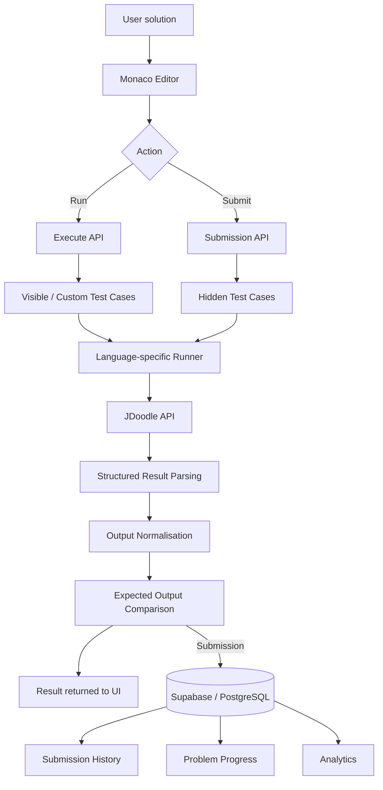

# Codey

A full-stack coding practice platform with multi-language code execution, server-side judging, progress tracking and personalised analytics.

**Live demo:** https://codey-lyart.vercel.app/

Codey implements the core systems behind an online coding judge. Users can solve algorithm and data-structure problems in a Monaco-based coding workspace, run solutions against visible or custom test cases, and submit them for evaluation against hidden test cases.


## Features

* **150 coding problems** across common algorithm and data-structure topics
* **Multi-language execution** for JavaScript, Python, Java and C#
* **Server-side judging** against hidden test cases with failed-case feedback
* **Monaco coding workspace** with starter code, persistent drafts and custom test cases
* **Authentication and persistence** using Supabase and PostgreSQL
* **Progress tracking** for solved and attempted problems
* **Submission history** with runtime, memory usage and submitted code
* **Personal analytics** covering acceptance rates, languages, submission trends and problem-solving time
* **Responsive interface** with light and dark themes

## Engineering

### Server-side judging

Codey separates interactive test runs from authoritative submissions.

When a solution is submitted, the server:

1. Verifies the authenticated user.
2. Loads the problem and its hidden test cases.
3. Generates the appropriate language-specific runner.
4. Executes the solution through the JDoodle API.
5. Parses structured test results.
6. Normalises and compares actual and expected outputs.
7. Records the submission in PostgreSQL.
8. Updates the user's problem-completion state when accepted.
9. Returns the result and failed-case information to the workspace.

Keeping submission evaluation on the server prevents the browser from deciding whether its own solution should be accepted.

### Cross-language execution

JavaScript, Python, Java and C# require different handling for:

* invoking user-defined solutions
* constructing arrays, lists and objects
* serialising return values
* representing booleans and null values
* handling compilation and runtime errors

Codey uses language-specific runner wrappers while converting execution results into a shared representation used by the judge and interface.

### Structured execution results

User programs can print arbitrary output, so ordinary console output cannot safely be treated as judge data.

Runner scripts emit machine-readable result markers separately from user logs. Codey parses those structured results before evaluating each test case.

Outputs may arrive as JSON, language-specific literals or plain text. The comparison layer attempts structured parsing and normalisation before falling back to trimmed text comparison.

### Persistent editor state

Draft code is stored independently for each combination of:

```text
problem + programming language
```

Switching languages or leaving a problem does not discard the user's work.

Authenticated users can also retrieve their most recently submitted solution for a problem and language.

### Authentication and data access

Authentication and application data are managed with Supabase.

Row Level Security policies restrict users to their own:

* profile
* submissions
* problem-completion records

Administrative database operations use a separate server-only Supabase client.

### Analytics

The analytics system separates:

1. database retrieval
2. metric calculation
3. presentation

Users can track:

* solved problems by difficulty
* submission and acceptance trends
* completion rate
* language usage and acceptance rates
* attempts per problem
* recently solved problems
* active practice days
* total problem-solving time
* average and median submission time
* average time to first accepted solution

## Architecture



### Run

**Run** lets users execute their solution against visible or custom test cases without creating a submission.

```text
Editor
  ↓
POST /api/execute
  ↓
Language-specific runner
  ↓
JDoodle
  ↓
Parsed test results
  ↓
Console
```

### Submit

**Submit** evaluates the solution against the complete server-side test suite and records the attempt.

```text
Editor
  ↓
POST /api/submit/[slug]
  ↓
Authentication
  ↓
Hidden test cases
  ↓
Language-specific runner
  ↓
JDoodle
  ↓
Result parsing and comparison
  ↓
Submission persistence
  ↓
Progress update
```

## Screenshots

### Problem workspace

<!-- Add problem workspace screenshot here -->

### Analytics dashboard

<!-- Add analytics dashboard screenshot here -->

### Submission history

<!-- Add submission history screenshot here -->

## Technology Stack

| Area           | Technology                        |
| -------------- | --------------------------------- |
| Frontend       | Next.js 16, React 19, TypeScript  |
| UI             | Tailwind CSS, shadcn/ui, Radix UI |
| Code editor    | Monaco Editor                     |
| Backend        | Next.js Route Handlers            |
| Database       | PostgreSQL / Supabase             |
| Authentication | Supabase Auth                     |
| Code execution | JDoodle API                       |
| Charts         | Recharts                          |
| Deployment     | Vercel                            |

## Project Structure

```text
Codey/
├── app/
│   ├── (site)/
│   │   ├── problems/
│   │   ├── submission-history/
│   │   ├── account/
│   │   └── components/
│   ├── api/
│   │   ├── execute/
│   │   └── submit/[slug]/
│   ├── components/
│   │   ├── editor/
│   │   └── ProblemWorkspace/
│   └── data/
├── components/
│   └── ui/
├── lib/
├── public/
├── supabase/
│   └── migrations/
├── utils/
│   └── supabase/
└── middleware.ts
```

## Getting Started

### Prerequisites

* Node.js 20 or later
* npm
* Supabase project
* JDoodle API credentials

### 1. Clone the repository

```bash
git clone https://github.com/akakj/Codey.git
cd Codey
```

### 2. Install dependencies

```bash
npm install
```

### 3. Configure environment variables

Create a `.env.local` file in the project root:

```env
NEXT_PUBLIC_SUPABASE_URL="your-supabase-project-url"
NEXT_PUBLIC_SUPABASE_PUBLISHABLE_KEY="your-supabase-publishable-key"

SUPABASE_SECRET_KEY="your-supabase-secret-key"

JDOODLE_CLIENT_ID="your-jdoodle-client-id"
JDOODLE_CLIENT_SECRET="your-jdoodle-client-secret"
```

`SUPABASE_SECRET_KEY` and the JDoodle credentials must remain server-only and must not use the `NEXT_PUBLIC_` prefix.

### 4. Configure Supabase

Apply the SQL migrations in:

```text
supabase/migrations/
```

The IDs stored in the database `problems` table must correspond to the `problemID` values in the problem catalogue because submissions and completion records reference those IDs.

### 5. Start the development server

```bash
npm run dev
```

Then open:

```text
http://localhost:3000
```

## Limitations

Codey is designed as a portfolio-scale online judge rather than a production sandboxing platform.

* Code execution depends on the JDoodle API and its request limits.
* Large execution outputs may be truncated by the external execution service.
* The problem catalogue is curated rather than user-generated.
* Execution does not provide the isolation guarantees of a dedicated container-based judging infrastructure.

## Acknowledgements

Codey is inspired by coding-practice platforms such as LeetCode and by the structured topic-based approach of NeetCode.

It is an independent project and is not affiliated with either platform.

## License

This repository currently has no open-source licence. Unless a licence is added, the source code is not automatically licensed for reuse, modification or distribution.
